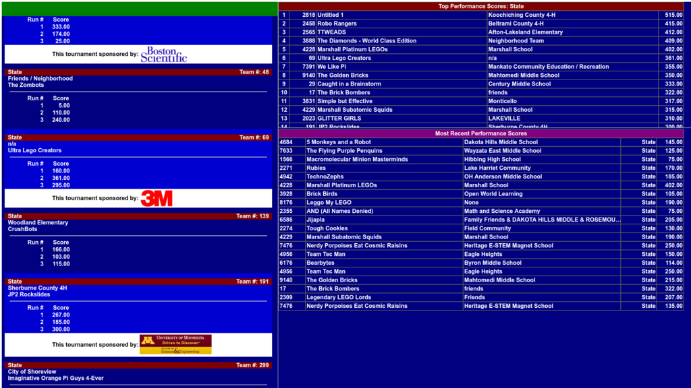
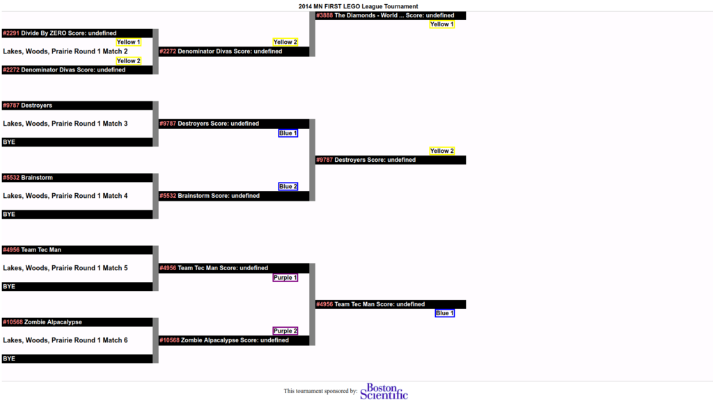

**Please READ ALL INSTRUCTIONS before choosing computers or installing software**

If you are in Minnesota, read [the Minnesota Notes page](MinnesotaNotes.md) in addition to this one.

Required files
==============

  * Download the latest version of the software

Physical setup notes
====================

When powering the computers, make sure that the power cords are secured. In many cases one may need to tape extension cords together and tape the plug to the wall to ensure that the cords do not come disconnected during the tournament.

Find a good place in your performance area to put the computers that can be accessed from the performance tables to get score sheets and still be out of the way of traffic.

Roles of Computers
==================

Tournament computers perform 4 Roles:  Server, Display, Performance Score Entry, and Subjective Score Entry. These Roles define which software is required on each computer. Below you will find a description of each Role and links to required software and supporting documentation.

Server
------

This Role is the brains behind the whole system. **The Server holds the database and the web server**. The Server computer requires the most horsepower. **Suggested hardware**: something with a 1Ghz processor and 1GB RAM. This computer must have a network connection (Ethernet or wi-fi) and be able to connect to the performance score entry computers and the display computer(s).

The Server is also used to print reports so it needs to have a printer attached. Technically any computer on the network can be used for printing, but the Server is usually a logical choice. I would stick with a small laser printer as they print reasonably fast and it is only necessary to print in black and white. Any printer will work, though a higher page-per-minute speed will be appreciated during head to head competition.
 
**Required Software**:  The Server requires the [Java JRE](InstallJava.md), the [server software](InstallServerSoftware.md), a [Supported Web browser](SupportedWebBrowsers.md), and appropriate printer drivers.

Display
-------

The Display Computer is **used to display scores**, either on the Display Computer's screen or on an LCD projector. **LCD projector is recommended**.  **Suggested hardware**: something with a 1Ghz processor and 1GB RAM. The important part is that the display be good and the scrolling of web pages can keep up. The monitor/projector and video card need to be capable of at least 800x600 resolution.  **Suggested resolution:  1024x768**, however I understand that LCD projectors of this resolution may be expensive. There is no added benefit from projectors of resolution greater than 1024x768. This computer needs to be networked to the server. The Display Computer should have it's screen saver disabled and any power mangement screen blanking settings turned off. 

**Required Software**: [Supported Web browser](SupportedWebBrowsers.md). 

**Notes on where to display**:
When setting up the tournament, make sure there is a good place for teams to see the scores. A large white wall high up in a gym works pretty well, provided the gym is dark enough. At larger tournaments we've tapped into the building's TV monitors or setup extra-large monitors with extra computers around the performance and pit areas.

Make sure that you know how to disable the popup blocker either for individual sites or for all sites. The starting of the big screen display will typically trigger a popup blocker because of how the windows are opened.

Make sure that you know how to disable the screen saver on the display computers so that the screen doesn't go off or the computer goto sleep during the tournament.

Performance Score Entry
-----------------------

The Performance Score Entry computer is used to enter performance scores. The hardware requirements are the same as the Display Computer with the exception that output to an LCD projector is not needed. Users will use a web browser to enter scores.  **Suggested**:  A reasonable size screen is nice and a good mouse is a plus, but trackpads on laptops work fine too.

**Required Software**: [Supported Web browser](SupportedWebBrowsers.md). 

Subjective Score Entry
-----------------------

The Subjective Score Entry Computer is used to enter the scores from subjective judging. The hardware requirements are the same as the Display Computer with the exception that output to an LCD projector is not needed.  **Suggested resolution**:  1024x768. This computer needs to be networked to the server.

**Required Software**: [Java JRE](InstallJava.md) and [subjective software](InstallSubjective.md) OR Subjective Web App and a [Supported Web browser](SupportedWebBrowsers.md). 

Number of computers
===================

Of course, now that you know the Roles to be performed and the hardware requirements, you'll want to know how many computers you really need. It is possible to run a tournament all on one computer (this would not include a display computer) with all software installed on this one computer, although that's not suggested. You'll also need one person per computer (except the display computer) for the entire tournament, which is sometimes handled by taking shifts.

Minimum number of computers
---------------------------

The smallest tournament I've run has been an 8-team tournament with 2 computers. The configuration looks like this:

  * 1 computer that is used as the Server, Performance Score Entry, and Subjective Score Entry.
  * 1 Display Computer

Average number of computers
---------------------------

An average tournament has between 16 and 32 teams runs pretty well with the following configuration.

  * 1 Server that is also used for Subjective Score Sntry
  * 2 Performance Score Entry computers. Assuming 2 full performance tables are being used (4 teams competing simultaneously). If more tables are used add one Performance Score Entry computer for each full table.
  * 1 Display computer The bigger the tournament the more important it is to have a 1024x768 display and a good place to display the scores.

Large number of computers
-------------------------

The Minnesota state tournaments tend to be rather large, so I use this for the large tournament example. Large is between 64 and 75 teams and has thousands of people and lots of hype and pressure, so it's really nice to have extra computers.

  * 1 Server
  * 1 Performance Score Entry computer for each full table. A full table is one in which two teams compete simultaneously. State tournaments typically have 4 tables and 4 Performance Score Entry computers.
  * 1 Display computer and a nice AV guy who can send the display to all of the LCD projectors. At this point you should really have a computer and LCD projector combination that is capable of projecting at 1024x768 resolution and filling a 10 foot screen. 
  * 1 Subjective Score Entry computer for each subjective category. At the time of this writing, this is 4. You may think this is overkill, but I have each of the 4 major subjective categories on a dedicated computer (in the case of the research category this tends to be 3 categories on the same computer though). This seems to be a nice way to break up duties and keeps the score entry people busy without getting them too stressed out towards the end of the tournament when all of the scores come in and need to be checked.
    * If using tablets for subjective scoring, then the Subjective Score Entry computer is not required
   

Extra computers that are nice to have
-------------------------------------

  * 1 computer that is capable of looking up scores and printing reports while issues or problems are being worked out on the Server. Sometimes 2 printers are useful, one on the Server and one on the extra computer.  It does happen that one person wants to print head to head brackets at the same instant another person wants to print the score report used for medal determination (I speak from experience).
  * 1 computer, tablet or phone that is capable of being used by the refs only for looking up performance scores for disputes and for displaying the admin version of the brackets to keep track of what's going on during the head to head brackets.
  * 1 or more extra display computers that just have monitors on them and can be looked at by teams around the performance area or, if a good network is available, placed around the tournament site. If used one could get away with only a single LCD projector. Make sure to remove the keyboard and mouse so people don't get into them and mess with the scores. 

Install Instructions
====================

These instructions are geared towards Windows, if installing on Linux the instructions are mostly the same, with the exception of getting prompted for installation locations. In these instructions locations are given for all installs, these are not hard coded into the software anywhere, but it'll make things a lot easier for me to debug over the phone if you use the same directories.
**Assumption:  the Server, Display and Performance Score Entry computers are already networked and you KNOW THE IP address of the Server.**
You can download the current version of the software by clicking on the button below.
[[download_button]] 
Unzipping this file will create a directory called fll-sw that contains the various zip files referenced here.
If you do not have a zip tool to open up the archives you can use the jar tool that comes with Java and follow the instructions below.

  1. Install Java
  1. Copy the zip file to the directory you want to uncompress it in
  1. Open a command prompt, on windows use Start->Run->command return
  1. Change to the directory you put the zip file in, on windows cd <path to zip file>
  1. Execute jar -xf zipfile
  1. You should now have the files uncompressed in a directory and you can move them around as needed.
  1. [Install Java (the JRE) 1.8 or higher](InstallJava.md) (the language everything is written in). If you downloaded a version of the software is the JRE bundled in, then you can skip this step for the server. This needs to be done on the server and on any machines that will be used to enter subjective scores.
  1. Test the server
      1. Open an explorer window to the directory you you unzipped install file into. It should be called something like fll-sw-<version>
      1. Unzip the install file to a location that you want to run from.
      1. Run fll-sw.exe (fll-sw.sh on Linux and Mac)
        * This will bring up the launcher
      1. Click on Start Webserver        
        * This will cause a command window to come up, don't close it, you can minimize it though. 
        * Server errors will show up here. 
        * If you are running Windows XP or later, you may get prompted by the firewall dialog asking if Java has permission to use the network, you need to click Unlock otherwise clients won't be able to connect
      1. If the database has already been initialized, then you're done unless you want to change the challenge descriptor. If so, click on the setup database link. If the database has not been initialized, then you'll be redirected to the setup page.
          1. Select the challenge descriptor or upload one and click submit
          1. If this succeeds, click on the link to the main page
          1. From here you'll be instructed to enter a username and password. This is used to access all pages that can make changes or display information that the teams should not see.
      1. Goto the Instructions page for information on using these pages
      1. Note that you will need a username and password to access all pages that can make changes or display information that the teams should not see. Other pages can be viewable by the general public, so the network can be shared.
      1. From the score entry computers and scoreboard computers make sure you can also get to this page, replacing localhost with the IP address of the server
      * You can find links to copy to the score entry computers at the bottom of the main page
      1. When done for the day shutdown tomcat by going to bin and running stop-tomcat.bat.
  1. Subjective
      1. Follow the instructions above for installing Java
      1. Unzip subjective.zip to a location on the computer
      1. Goto a computer that's connected to the server and goto the main page, then Administration then Download the datafile for subjective score entry
      1. Save this file somewhere on the computer used for subjective score entry, this can be copied around with a floppy
      1. Run subjective.bat from the location you unzipped subjective.zip and when prompted give it the location of the subjective.zip file that was downloaded from the server
      1. Enter scores for teams by selecting the category tab at the top then entering the scores under each subcategory
      1. Save often
      1. When done, quit the application and copy the file back to a computer that has access to the server
      1. Goto Adminstration and click on the Browse button next to Upload the datafile for subjective scores
      1. Select the file you just copied
      1. Click upload and if all is well you'll be returned to the Adminstration page again
  1. When you're done for the day you should make a copy of the database for the head of your state.
      1. Shut down tomcat
      1. Send a copy of tomcat/webapps/fll-sw/WEB-INF/flldb.* to the head of your tournaments
  1. For those interested in looking at the source and possibly making changes the source can be found [here](Home.md). Developers please look at README.developer. Any changes that you do make need to be sent back to me under the terms of the GPL. I look forward to any fixes you make. Please follow the coding standards listed [here](http://mtu.net/%7Ejpschewe/java/CodingStandards.html).
  1. Once you're done with the tournament you might want to uninstall everything. This can be accomplished by deleting the JAVA_HOME environment variable. Then uninstalling the JDK from the control panel.

Sponsor Logos
=============

In version 4 of the software we added the ability to have sponsor logos displayed. These logos are displayed on the main welcome page, in between team scores on the scoreboard and on the bottom of the head to head brackets page. Any files with image extensions (currently the list is: `.jpg`, `.jpeg`, `.gif`, `.png`) put into the directory `tomcat/webapps/fll-sw/sponsor_logos` will be displayed on these pages. See the `README.txt` file in this directory for information about sizing. The welcome page lists the logos sorted by filename, so you can to show the sponsors in a particular order, say by amount donated. The logos are displayed the other pages in a random order.

Here are some screenshots of what the pages with logos look like.

Slideshow
=========

There is an option to display a slide show on the big screen display.
This option shows all image files (`.jpg`, `.jpeg`, `.gif`, `.png`) from the directory `tomcat/webapps/fll-sw/slideshow`.
The images are displayed in order, so naming them starting with 2-digit or 3-digit numbers helps to know the order in which they will be displayed in.

