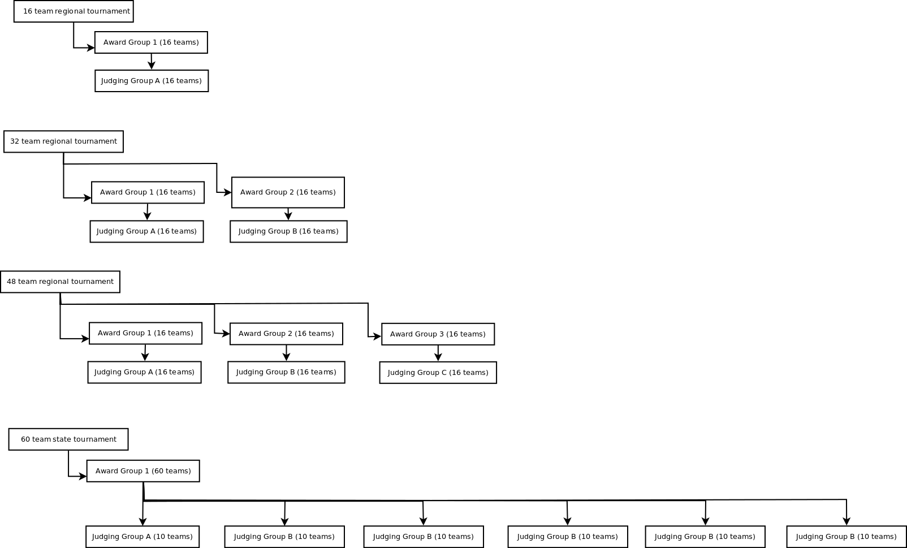

Grouping Teams
==============

There are a number of different ways that teams are grouped in the software. 
This describes the different groups and what they mean.

Award Group
--------------

At each tournament a team is put into an award group.
An award group is a group of teams that are competing against each other.
There are one set of awards for each award group.
Teams in different award groups may compete on opposite sides of the performance table from each other during the seeding rounds.
This is OK because teams are just going for the best score at this point and not really competing against the team on the other side of the table.

Judging Group
-------------

Each team is assigned to a judging group for subjective judging.
This defines which set of judges they will see for the subjective scoring categories.

At larger tournaments with a single award group, the teams in the award group are split up into multiple judging groups.
A second level of judging is needed to choose the best team in the award group because the scores from one judging group may not correlate to scores from another judging group.
To accomplish this, the top team in each judging group in each subjective category is judged again by a common set of judges to choose the winner in an award group for a category.

See the diagram at the bottom of this page for some examples.

Score Categories
================

There are 2 types of scoring categories.
Performance and subjective.
Categories are made up of goals.
All scores for the goals in a category are added together to determine the raw score for a category.
Each category has a weight that determines how much that score contributes to a team's overall score.
This weight is multiplied by the scaled score for a category and then summed to determine their overall score.
See [score normalization](ScoreExplaination.pdf) for details on how raw scores become scaled scores.

Performance
-----------

There is currently only one performance category at each tournament.
Performance scoring is objective.
All of the goals have a set of rules to determine what score a team gets for the goal.

Subjective
----------

This is sometimes referred to as judging scores.
There can be unlimited subjective categories.
Goals in a subjective category are scored within a range by a judge.
Each judge may use different parts of the range and therefore may come up with a different score for the same team than another judge.
For this reason, to determine the winner in a subjective category a single judge must see all teams in an award group or finalist judging must be used.

Head to Head
============

This is an optional part of a tournament.

Head to Head is a single elimination competition bracket.

Each head to head bracket contains a group of teams that will compete against each other to determine a head to head winner.
In most cases, a head to head bracket correlates directly to an award group.
However at some large tournaments where finalist judging is used an award group may be split into two or more head to head brackets.
These teams will then compete and determine a winner.
Then the top teams or teams in each head to head bracket will compete in another head to head bracket to determine the award group winner of head to head.

Teams are seeded into the bracket based on some criteria; usually this is based on the scores from the performance rounds.
A team then competes against the team across the table from them in a match.
The team with the best score continues on.
See [Wikipedia article on single elimination tournaments](https://en.wikipedia.org/wiki/Single-elimination_tournament) for more information.

Example Tournament Configurations
=================================

Below are some example configurations based on tournaments that are run in Minnesota.
All judging groups max out at 16 teams as it is hard to have a single judge see more than 16 teams in a day.
At regional and sectional tournaments there exists an award group for every 16 teams.
This means that multiple sets of awards will be handed out and it avoids needing to do finalist judging.

For a 16 team tournament there is a single award group and a single judging group.

For a 32 team tournament there is are 2 award groups. Each award group has a judging group. In this case there will be 2 awards for each category.

For a 48 team tournament there is are 3 award groups. Each award group has a judging group. In this case there will be 3 awards for each category.

For a 60 team state tournament there is 1 award group with 6 judging groups.
There is a single award group because this is the championship tournament for the state and 1 winner in each category must be chosen.
Each judging group has 10 teams. 
This allows each judge to come up with their best team early in the day and allow for time to complete finalist judging.

 
